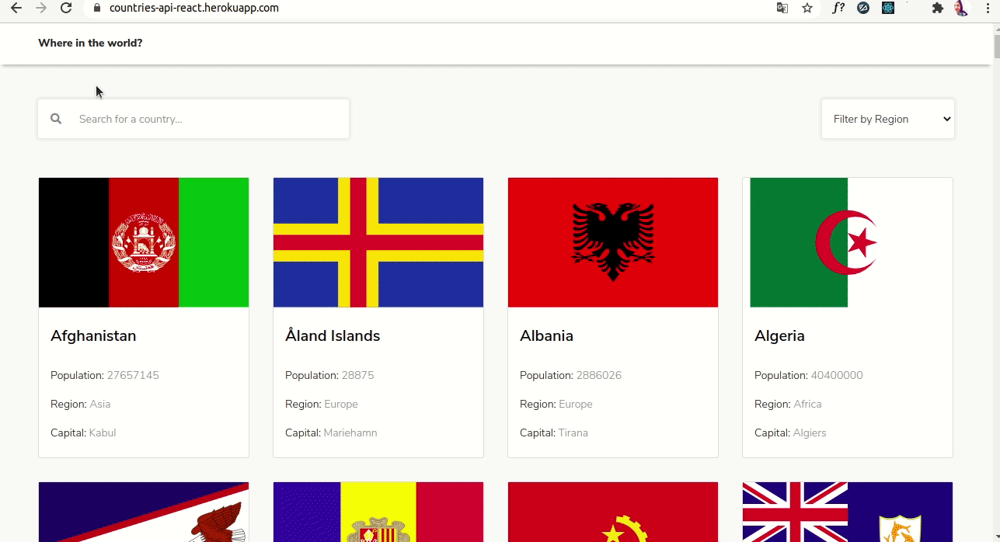

<h1 align="center">React - Countries Search Api</h1>

> This project consists in build the front-end of an application that allow users to see a list of all countries and the ability to filter by region and search by country name. In each country details the user can navigate between border countries. This apps consuming this [API](https://restcountries.eu/).

### ✨ [Demo](https://countries-api-react.herokuapp.com/)

## Preview



## Tools used
  
  * Node.js
  * React
  * React-DOM
  * React-Router-DOM
  * React-Create-App
  * API
  * npm
  * CSS
  * ES6

## Install

```sh
npm install
```

## Usage

```sh
npm start
```

## Author

👤 **Amanda Vieira**


- Github: [@vieiramanda11](https://github.com/vieiramanda11)
- Linkedin: [Amanda](https://www.linkedin.com/in/amandavieira23/)